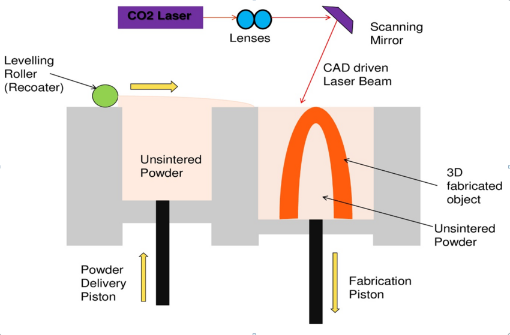

### Selective Laser Sintering
* Selective Laser Sintering (SLS) is a powder bed fusion AM technique. A variety of materials, such as plastics, glass & ceramics can be printed using SLS machines.
* SLS uses a high-powered C02 laser to selectively fuse small particles of powdered material below thier melting point to create three dimensional parts. 

* The powder and the build platform are preheated to a temperature just below the melting temperature of the polymer. 
* The piston of the powder container moves upward and the piston of the fabrication container moves downward. This step gives requisite powder to be carried away by leveling roller and space on the fabrication container for the powder to be deposited.
* The deposited powder layer is scanned by the laser beam to fuse powders at the selected area.  The fabrication piston moves down by a depth equal to the layer thickness and a thin layer of powder is re-spread over the fabrication platform and position of leveling roller changes to right of fabrication platform .The process then repeats until the whole part is complete. 
* A cool-down period is required to allow the parts to uniformly come to a low-enough temperature that they can be handled and exposed to ambient temperature and atmosphere.
* The parts are then cleaned with compressed air or other blasting media and are ready to use or further post process. The remaining unsintered powder is collected and can be reused.
* A metal based SLS technique is called Direct Metal Laser Sintering (DMLS). 
* Low cost per part as compared to conventional subtractive manufacturing, high productivity(as parts can be produced in shorter span of time), and established materials like nylon make the technology ideal for a range of applications from functional prototyping to small batch or bridge manufacturing.

### SLS Principle
The SLS process is based on the following two principles:
1. Three dimensional objects are formed by selectively sintering (fusing) powder particles using a laser beam which raises the temperature to point just below its melting in order to bond the particles together and with previous layer
2. The building of the part is done layer by layer. The next layer is then built directly on top of the sintered layer after an additional layer of powder is deposited on top of the previously formed layer.

### Materials
*	Polypropylene- tough & very high elongation at break
*	Alumide- Blend of aluminium powder and polyamide powder
*	PA12-Polyamide & Biocompatible and food-safe under certain conditions
*	PA GF- Polyamide powder filled with glass particles, which have much have thermal resistance than polyamide.
*	TPU92A-1 Rubberlike thermoplastic polyurethane & Fully-functional flexible and strong material.
*	PA2241 FR - Flame-resistant polyamide (PA 12) & Suitable for aeronautics & aerospace applications.
* Lasers: CO2 and Ytterbium (Yb)-fiber lasers are commonly used in SLS processes, depending on the type of material.

### Applications
* SLS has proved to be particularly useful for industries that need only a small quantity of objects printed in high quality materials. 
* SLS machines can print in a range of high-quality materials, from flexible plastic to food-grade ceramic. 
* SLS is a popular method for 3D printing customized products, such as hearing aids, dental retainers and prosthetics.
* SLS has been recognized as a useful tool initially for fabrication of bone implants. 
* It is used in Rapid Prototyping for design and evaluation of models, design verification and product performance and testing. 
* It also used for investment casting patterns and Jigs& Fixtures.
    Examples:
   •	Boeing Uses Prototyping to Maximize Return on Investment
   •	Reebok Uses SLS Process for Developing Sports Shoes
   •	Rover Applies SLS Process in Tooling for Injection Molding

### Limitations
1.	Parts produced have a grainy surface finish and internal porosity so post processing may be required to obtain required surface finish.
2.	Expensive setup due to laser. This limits the current range of applications of PBF to only high-value parts that are used in industries such as aerospace, industrial power generation, and others with extreme environments where the high part cost can be justified.
3.	Thermal distortion is another problem which can cause shrinking and warping of fabricated parts. So, large flat surfaces and small holes cannot be printed accurately as they are susceptible to warping and oversitnering. Both during and after the build, a carefully managed cooling process is critical to help prevent warping and other thermal distortions.
4.	Careful handling of the powder feedstock is essential for health and safety reasons.